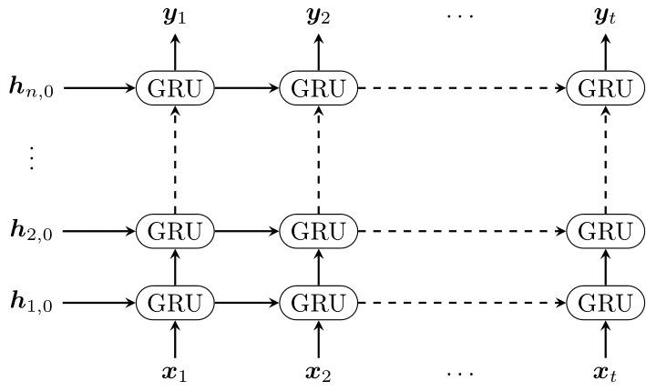

# GRU RNN (Gated Recurrent Unit Recurrent Neural Network)

## Info

Grid representation of a deep RNN with $n$ layers of GRU cells over a sequence of lenth $t$.

## Output

## Source

My first year PhD report.
