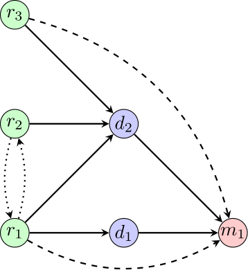

# Patient graph

## Info

A simple graphical representation of the interactions and dependencies between readings/results, diagnoses and medications/treatments at a single point in time.

## Output

## Source

My first year PhD report.
