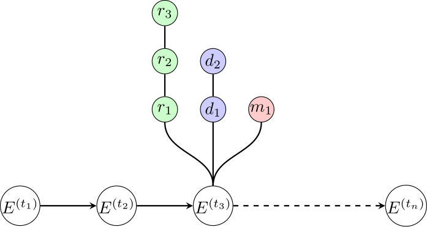

# Patient timeline

## Info

A simple representation of how time points in a patient timeseries contain multiple events, including results/readings, diagnoses and medications/treatments.

## Output

## Source

My first year PhD report.
