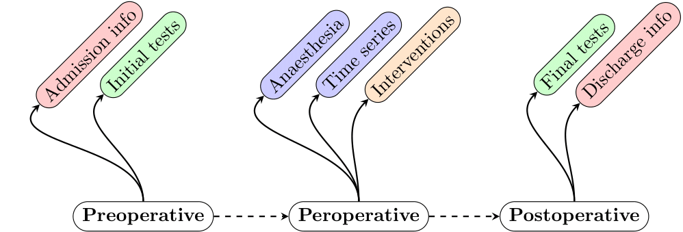

# Perioperative timeline

## Info

A simple diagram representing the different types of data occuring through a patient's timeline before, during and after surgery.

## Output

## Source

My first year PhD report.
